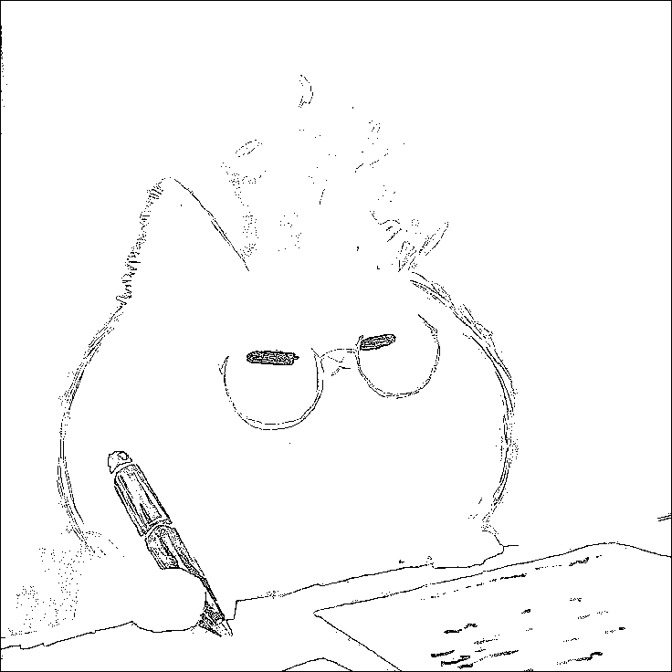
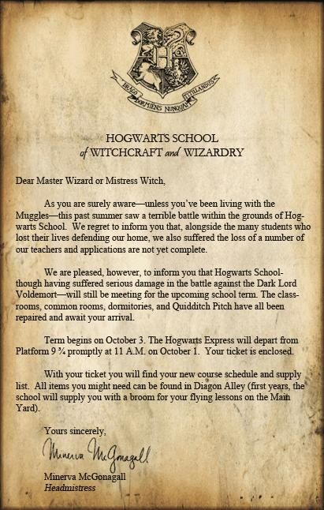
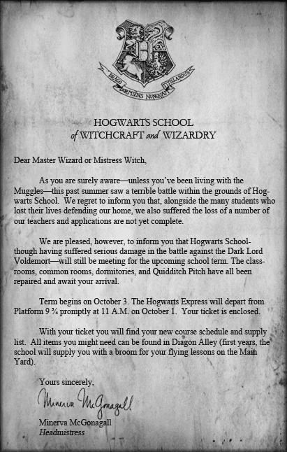
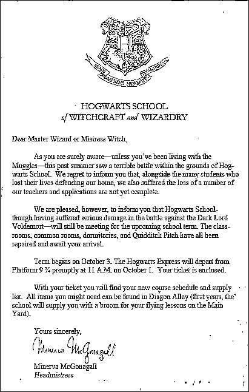
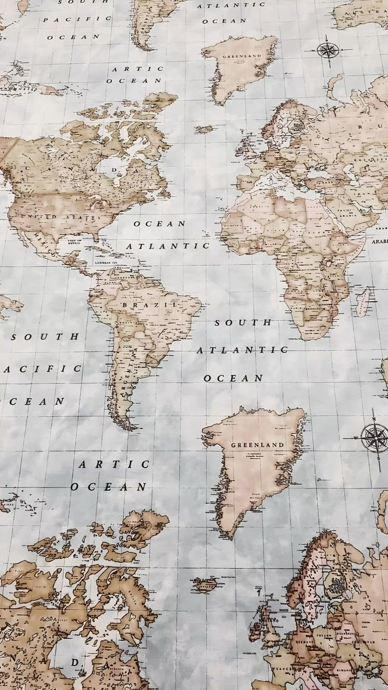
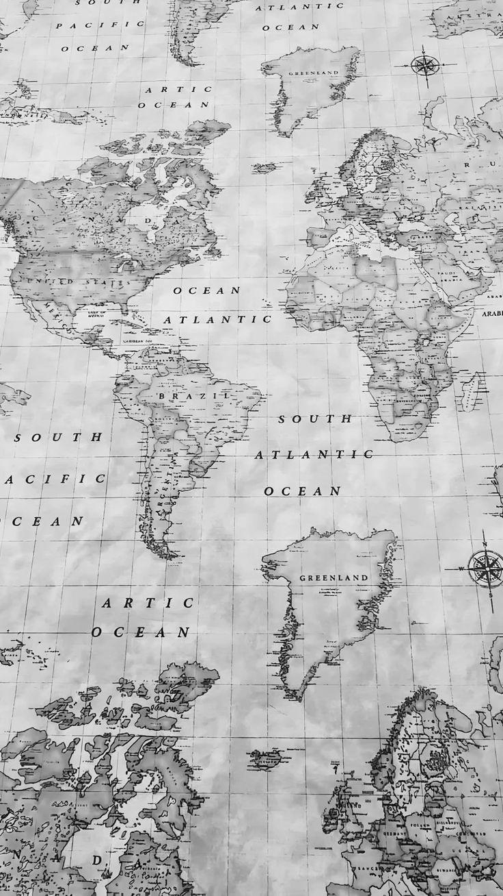
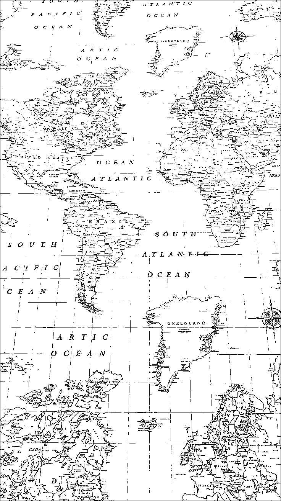
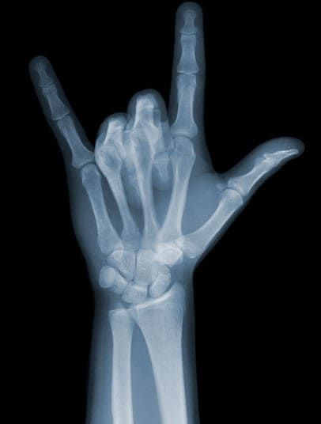
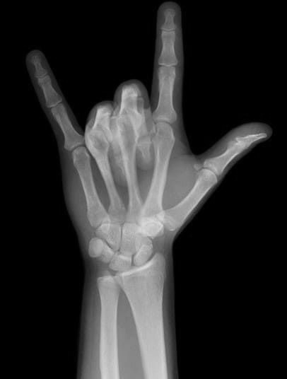
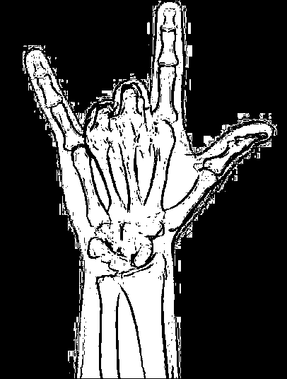

# OAVI_lab2

### Вариант 9
_Полутоновые изображения и бинаризация_

Была поставлена следующая задача:

1.  Преобразование цветного изображения в полутоновое.
2.  Адаптивная бинаризация полутонового изображения методом Сингха с окном 3x3.

***

## Функции

Функции для выполнения заданий находятся в файле `binarization.py`.

- `grayscale(filename: str, resultAverFilename: str)`
    > Преобразует цветное изображение в полутоновое, используя усреднение каналов RGB.
    >
    > _ПАРАМЕТРЫ:_
    >    * **filename** - Имя файла с исходным цветным изображением.
    >    * **resultAverFilename** - Имя файла, в который будет сохранено полутоновое изображение.

- `singh(filename: str, resultFilename: str, k: float = 0.2, R: int = 128)`
    > Выполняет адаптивную бинаризацию полутонового изображения методом Сингха с окном 3x3.
    >
    > _ПАРАМЕТРЫ:_
    >    * **filename** - Имя файла с исходным полутоновым изображением.
    >    * **resultFilename** - Имя файла, в который будет сохранено бинаризованное изображение.
    >    * **k** - Параметр k для метода Сингха, контролирующий чувствительность к отклонению стандартного отклонения от R. По умолчанию 0.2.
    >    * **R** - Параметр R для метода Сингха, базовое значение стандартного отклонения. По умолчанию 128.

---

# Работа программы

## Картинка

### Оригинальное изображение:

_Параметры: k = 0.15, R = 80_

### Полутон и бинаризация:

<table>
  <tr>
    <td></td>
    <td></td>
  </tr>
</table>

## Текст

### Оригинальное изображение:

_Параметры: k = 0.25, R = 90_

### Полутон и бинаризация:

<table>
  <tr>
    <td></td>
    <td></td>
  </tr>
</table>

## Карта

### Оригинальное изображение:

_Параметры: k = 0.15, R = 130_

### Полутон и бинаризация:

<table>
  <tr>
    <td></td>
    <td></td>
  </tr>
</table>

## Рентген

### Оригинальное изображение:

_Параметры: k = 0.15, R = 7_

### Полутон и бинаризация:

<table>
  <tr>
    <td></td>
    <td></td>
  </tr>
</table>